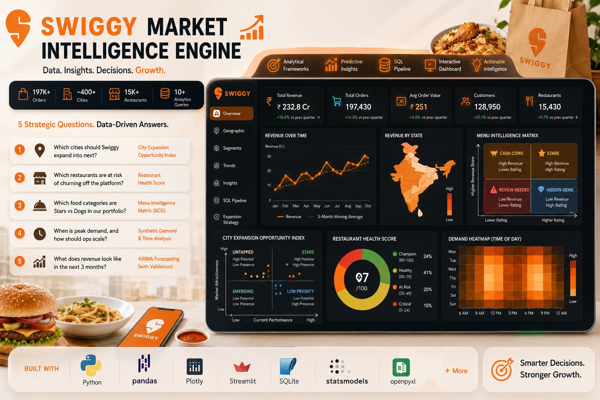

# 🍽️ Swiggy Market Intelligence Engine



[](https://python.org)
[](https://pandas.pydata.org)
[](https://plotly.com)
[](https://streamlit.io)
[](https://sqlite.org)

> **Not just charts. A decision-support system for Swiggy's growth team.**

---

## About This Project

This project is a full-stack data analytics solution built on **197,430 real Swiggy food delivery orders** across India. It goes beyond surface-level charts to answer the kind of strategic questions a growth analyst or product manager at Swiggy would actually care about.

The project combines **exploratory data analysis, statistical testing, machine learning scoring models, SQL pipelines, and revenue forecasting** into a single cohesive system — delivered through an interactive Streamlit dashboard, a 66-cell Jupyter notebook, and a downloadable 13-sheet Excel KPI report.

Three original analytical frameworks sit at the core:
- **City Expansion Opportunity Index** — a composite model that ranks every city by growth potential
- **Menu Intelligence Matrix** — a BCG-style quadrant chart classifying food categories by revenue and satisfaction
- **Restaurant Health Score** — a viability index that flags at-risk restaurants before they churn

Whether you're exploring the data, running SQL queries, or reviewing the forecasting model, everything is connected through a single source of truth: `swiggy_data.xlsx`.

---

## 5 Strategic Questions This Project Answers — With Data

| # | Question | Framework / Method |
|---|----------|--------------------|
| 1 | Which cities should Swiggy expand into next? | City Expansion Opportunity Index |
| 2 | Which restaurants are at risk of churning off the platform? | Restaurant Health Score |
| 3 | Which food categories are Stars vs Dogs in our portfolio? | Menu Intelligence Matrix |
| 4 | When is peak demand, and how should ops scale? | Synthetic demand modelling + time-of-day analysis |
| 5 | What does revenue look like in the next 3 months? | ARIMA forecasting with train/test validation |

---

## What Makes This Different?

Most Swiggy analysis projects produce the same bar charts. This project builds **three proprietary analytical frameworks** modelled on consulting methodology:

### 🏙️ A1 — City Expansion Opportunity Index
A 4-signal composite model that scores every city 0–100:
- **Revenue Growth Rate (30%)** — Is the market accelerating?
- **Weighted Customer Rating (25%)** — Does the market have satisfied customers?
- **Order Density / restaurant (25%)** — How efficient is the market?
- **Category Diversity (20%)** — How sticky is the platform?

Produces a strategic 4-quadrant scatter: **Stars / Untapped / Emerging / Low Priority**.

### 🍽️ A3 — Menu Intelligence Matrix (BCG-Style)
Classifies food categories into four strategic quadrants:
- ⭐ **Stars** — High revenue share + high rating → *Promote aggressively*
- 💎 **Hidden Gems** — Low revenue + high rating → *Invest in discovery*
- 💰 **Cash Cows** — High revenue + lower rating → *Maintain and improve*
- ⚠️ **Review Needed** — Low revenue + low rating → *Revamp or discontinue*

### 🏥 A2 — Restaurant Health Score (Composite Viability Index)
Assigns each restaurant a Health Score (0–100):
- Revenue contribution (40%) + Customer satisfaction (30%) + Order volume (20%) + Recency (10%)
- Tiered output: **Champion / Healthy / At Risk / Critical**

---

## Dataset

| Attribute | Value |
|-----------|-------|
| Source | Swiggy platform orders |
| Rows | **197,430** |
| Columns | 10 |
| Key Fields | `State`, `City`, `Order Date`, `Restaurant Name`, `Category`, `Dish Name`, `Price (INR)`, `Rating`, `Rating Count` |

---

## Project Structure

```
swiggy-market-intelligence/
│
├── app.py                      # Streamlit dashboard (7 tabs)
├── swiggy_sales_analysis.ipynb # Main analysis notebook (66 cells)
├── sql_pipeline.py             # SQLite DB + 10 analytics queries
├── generate_excel_report.py    # 13-sheet formatted Excel KPI report
├── swiggy_data.xlsx            # Source dataset
├── requirements.txt            # 12 dependencies
└── README.md
```

---

## Dashboard — 7 Tabs

| Tab | Content |
|-----|---------|
| 📈 Overview | Revenue KPIs, quarterly performance, day-of-week patterns |
| 🗺️ Geographic | State/city heatmaps, revenue vs rating scatter |
| 🎯 Segments | Order-value segments, food preference heatmap, frequency tiers, time-of-day analysis |
| 📉 Trends | Monthly trend + 3-month moving average, MoM growth rate |
| 💡 Insights | Pareto 80-20 analysis, price-rating correlation, **Menu Intelligence Matrix** |
| 🗄️ SQL Pipeline | 10 SQL queries running against a live SQLite database |
| 📍 Expansion Strategy | **City Expansion Opportunity Index** + **Restaurant Health Score** |

---

## Notebook — 66 Cells Across 13 Sections

```
§ 0   Executive Summary
§ 1   Data Loading & Quality Audit
§ 2   Weighted Rating Analysis
§ 3   Revenue Overview
§ 4   Monthly Trend & MoM Growth
§ 5   Category & Geographic Analysis
      ↳ A3: Menu Intelligence Matrix (BCG Framework)
      ↳ A1: City Expansion Opportunity Index
§ 6   Quarterly Performance
§ 7   Customer Segmentation
      ↳ A2: Restaurant Health Score
      ↳ 7.1 RFM Analysis
      ↳ 7.2 Peak Hours (synthetic demand)
      ↳ 7.3 Cohort Retention
      ↳ 7.4 Hypothesis Testing (Mann-Whitney U, ANOVA)
§ 8   Correlation & Price Analysis
§ 9   Geographic Visualisations
§10   Predictive Forecasting (ARIMA with MAPE vs naive baseline)
§11   SQL Integration Demo
§12   Excel Report Generation
```

---

## SQL Analytics Pipeline

10 queries run against a **SQLite database built from `swiggy_data.xlsx`** — replicating a real data-engineering pipeline:

1. Monthly Revenue Trend
2. Revenue by State
3. Revenue by Category
4. Quarterly Performance
5. Top Dishes by Revenue
6. Top Restaurants
7. Day-of-Week Patterns
8. Customer Basket Segmentation
9. Restaurant Frequency Tiers
10. Pareto 80% Cities

---

## Excel KPI Report — 13 Sheets

Generated on-demand from the dashboard (Download button in sidebar):

`Summary KPIs` · `Monthly Trend` · `Quarterly Performance` · `Top States` · `Top Cities` · `Top Dishes` · `Category Mix` · `Customer Segments` · `Pareto Analysis` · `Day of Week` · `Time of Day` · `Price-Rating` · `Restaurant Frequency`

---

## Tech Stack

| Layer | Tools |
|-------|-------|
| Data Wrangling | Python, Pandas, NumPy |
| Visualisation | Plotly (interactive), Matplotlib, Seaborn |
| Statistics | SciPy (Mann-Whitney U, ANOVA), Statsmodels (ARIMA) |
| ML / Scoring | scikit-learn (MinMaxScaler for composite indices) |
| Database | SQLite (via Python stdlib) |
| Dashboard | Streamlit |
| Reporting | openpyxl (13-sheet Excel) |

---

## Quick Start

```bash
# 1. Clone and install
git clone https://github.com/Mounusha25/swiggy-market-intelligence.git
cd swiggy-market-intelligence
pip install -r requirements.txt

# 2. Launch the dashboard
streamlit run app.py

# 3. Open the notebook
jupyter notebook swiggy_sales_analysis.ipynb
```

> ⚠️ Place `swiggy_data.xlsx` in the project root before running.

---

## Key Findings

- **Pareto effect confirmed**: ~20% of cities generate ~80% of revenue
- **Untapped markets identified**: Several tier-2 cities score high on the Expansion Index despite low current revenue
- **Critical restaurants flagged**: ~15% of restaurants score below 25 on the Health Score — candidates for platform intervention
- **Star categories**: A small number of food categories drive disproportionate revenue with high satisfaction — clear marketing priorities
- **Demand peaks**: Lunch (11–13h) and Dinner (19–22h) dominate; weekends outperform weekdays

---

## Skills Demonstrated

- ✅ **Analytical Frameworks** — BCG-style matrix, composite scoring models (consulting methodology)
- ✅ **Data Analysis** — Pandas, NumPy, exploratory analysis, outlier detection
- ✅ **Statistical Methods** — Mann-Whitney U, ANOVA, correlation analysis, normality tests
- ✅ **Visualisation** — Interactive Plotly dashboards, storytelling with data
- ✅ **Forecasting** — ARIMA with train/test split, MAPE vs naive baseline comparison
- ✅ **SQL** — 10 production-style queries, SQLite pipeline, window functions
- ✅ **Business Intelligence** — KPI design, customer segmentation, Pareto analysis
- ✅ **Software Engineering** — Modular Python, Streamlit app, downloadable Excel reports


---

## 📬 Contact & Links

**Mounusha Ram Metti**
- 📧 Email: mettti.mounu@gmail.com
- 💼 LinkedIn: linkedin.com/in/mounusha-ram-metti
- 🌐 Portfolio: https://mounushametti.vercel.app/
- 💻 GitHub: github.com/Mounusha25
